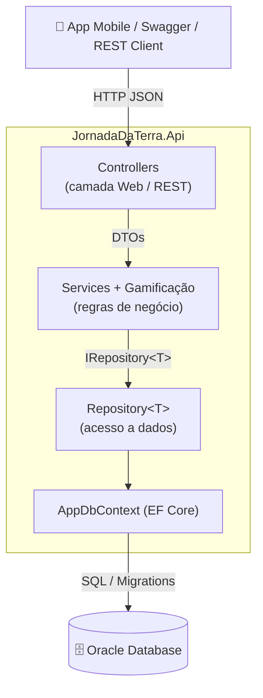
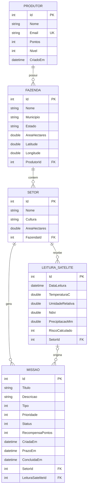

# 🌱 Jornada da Terra — API .NET (Agro & Clima Gamificado)

> **Global Solution FIAP 2026/1 — Advanced Business Development with .NET**
> API RESTful que traduz dados de monitoramento satelital em **missões gamificadas** para o pequeno e médio produtor rural.

---

## 1. A solução

O pequeno e médio produtor muitas vezes não tem acesso — ou acha complexo demais — usar dados de satélite para ganho de produtividade e prevenção de desastres.

A **Jornada da Terra** transforma a gestão da fazenda em uma jornada épica: o sistema lê indicadores orbitais de cada setor da propriedade (temperatura, umidade, NDVI, precipitação), calcula o **risco climático** e gera automaticamente **missões** no app do produtor — por exemplo:

> _"Alerta de geada no Setor Sul: temperatura de -1,5 °C detectada. Inicie a proteção da colheita."_

Ao concluir as missões, o produtor ganha **pontos** e sobe de **nível**, tornando o agronegócio acessível e engajador.

Este repositório contém a entrega da disciplina **.NET**: o **backend (API RESTful)** que gerencia o CRUD e o progresso da jornada.

---

## 2. Requisitos técnicos atendidos

| Requisito da disciplina | Onde está implementado |
|---|---|
| API REST com boas práticas / arquitetura | Arquitetura em camadas (Domain / Infrastructure / Application / Controllers) |
| Persistência em banco relacional | **Oracle** via **Entity Framework Core 8** |
| Pelo menos um relacionamento (1:N / N:N) | **Quatro** relacionamentos 1:N (ver diagrama ER) |
| Uso correto de Migration | Pasta `Migrations/` com `InitialCreate` + `ModelSnapshot` |
| Documentação no GitHub | Este README com diagramas, instruções e testes |

---

## 3. Arquitetura

O projeto segue uma **arquitetura em camadas** dentro de um único projeto Web API, com responsabilidades bem separadas. Optou-se por essa organização (em vez de múltiplos projetos) por ser **simples de navegar, testar e avaliar**, mantendo o baixo acoplamento entre as camadas.



**Fluxo de uma requisição:** o `Controller` recebe o DTO (já validado por Data Annotations) → chama o `Service`, que aplica as regras de negócio (ex.: gamificação) → o `Service` usa o `IRepository<T>` genérico → o `Repository` traduz para SQL via `AppDbContext` (EF Core) → Oracle.

### Por que essa arquitetura?

- **Separação de responsabilidades:** Controllers só lidam com HTTP; Services concentram a lógica; o Repository isola o acesso a dados.
- **Testabilidade:** os Services dependem da interface `IRepository<T>`, então podem ser testados com um repositório fake/mock, sem banco.
- **Baixo acoplamento:** trocar o provedor de banco ou a forma de mapeamento afeta apenas a Infrastructure.

### Como adicionar uma nova funcionalidade?

Exemplo — adicionar a entidade `Alerta`: (1) criar a entidade em `Domain/Entities`; (2) criar a `IEntityTypeConfiguration` em `Infrastructure/Data/Configurations`; (3) criar os DTOs e o mapeamento; (4) criar a interface + service em `Application/Services`; (5) criar o Controller; (6) registrar o service no `Program.cs`; (7) rodar `dotnet ef migrations add AddAlerta`. O `Repository<T>` genérico já atende o CRUD básico sem código novo.

---

## 4. Modelo de dados e relacionamentos



### Relacionamentos implementados (1:N)

1. **Produtor 1:N Fazenda** — um produtor possui várias fazendas.
2. **Fazenda 1:N Setor** — uma fazenda é dividida em vários setores.
3. **Setor 1:N LeituraSatelite** — um setor recebe muitas leituras ao longo do tempo.
4. **Setor 1:N Missao** — um setor acumula muitas missões.
5. **LeituraSatelite 1:N Missao** (opcional) — a leitura que originou cada missão.

### O que acontece ao deletar um registro?

- **Produtor → Fazenda → Setor → (Leituras + Missões):** `ON DELETE CASCADE`. Apagar um produtor remove, em cascata, suas fazendas, setores, leituras e missões.
- **Leitura → Missão:** `ON DELETE SET NULL`. Apagar uma leitura **não** apaga a missão (preserva o histórico): o vínculo `LeituraSateliteId` apenas fica nulo. Essa escolha também evita conflito de múltiplos caminhos de cascade no Oracle.

---

## 5. Migrations

As migrations versionam a evolução do schema do banco como código C#, permitindo recriar/atualizar o banco de forma reproduzível em qualquer ambiente.

- `Migrations/20260608120000_InitialCreate.cs` — cria todas as tabelas, chaves, índices e FKs.
- `Migrations/AppDbContextModelSnapshot.cs` — retrato do modelo atual, usado pelo EF para calcular o _diff_ da próxima migration.

```bash
# Aplicar as migrations (cria as tabelas no Oracle)
dotnet ef database update --project src/JornadaDaTerra.Api

# Criar uma nova migration após mudar o modelo
dotnet ef migrations add NomeDaMudanca --project src/JornadaDaTerra.Api

# Reverter a última migration
dotnet ef migrations remove --project src/JornadaDaTerra.Api
```

> Em ambiente **Development**, o `Program.cs` aplica as migrations automaticamente (`Database.MigrateAsync()`) e popula dados de demonstração no primeiro start.

---

## 6. Tecnologias

- **.NET 8** / ASP.NET Core Web API
- **Entity Framework Core 8** + **Oracle.EntityFrameworkCore**
- **Swagger / OpenAPI** (Swashbuckle) para documentação interativa
- **Oracle Database** (FIAP)

---

## 7. Como executar

### Pré-requisitos
- [.NET SDK 8.0+](https://dotnet.microsoft.com/download)
- Acesso a um banco **Oracle** (ex.: Oracle FIAP) e a ferramenta `dotnet-ef`:
  ```bash
  dotnet tool install --global dotnet-ef
  ```

### Passo a passo
```bash
# 1. Clonar o repositório
git clone https://github.com/<seu-usuario>/<seu-repo>.git
cd <seu-repo>/JornadaDaTerra.NET   # pasta que contém o .sln

# 2. Configurar a connection string em src/JornadaDaTerra.Api/appsettings.json
#    "OracleConnection": "User Id=RMxxxxxx;Password=SUA_SENHA;Data Source=oracle.fiap.com.br:1521/ORCL;"

# 3. Restaurar pacotes
dotnet restore

# 4. Criar as tabelas no banco
dotnet ef database update --project src/JornadaDaTerra.Api

# 5. Executar a API
dotnet run --project src/JornadaDaTerra.Api
```

A aplicação sobe em `https://localhost:7140`. O **Swagger** abre na **raiz** (`https://localhost:7140/`).

> Pelo **Visual Studio**: abra `JornadaDaTerra.sln`, defina `JornadaDaTerra.Api` como projeto de inicialização e pressione **F5**.

---

## 8. Endpoints

| Recurso | Método | Rota | Descrição |
|---|---|---|---|
| Produtores | GET | `/api/produtores` | Lista (paginado) |
| | GET | `/api/produtores/{id}` | Detalha |
| | POST | `/api/produtores` | Cria |
| | PUT | `/api/produtores/{id}` | Atualiza |
| | DELETE | `/api/produtores/{id}` | Remove (cascata) |
| Fazendas | GET/POST/PUT/DELETE | `/api/fazendas` | CRUD (filtro `?produtorId=`) |
| Setores | GET/POST/PUT/DELETE | `/api/setores` | CRUD (filtro `?fazendaId=`) |
| Leituras | GET/POST/DELETE | `/api/leituras-satelite` | Registra leitura e **gera missão automática** |
| Missões | GET/POST/DELETE | `/api/missoes` | CRUD (filtros `?setorId=` `?status=`) |
| | PATCH | `/api/missoes/{id}/status` | Atualiza status; ao **concluir**, credita pontos |

---

## 9. Regras de gamificação

Ao registrar uma leitura de satélite (`POST /api/leituras-satelite`), o `AvaliadorClimatico` calcula o risco e, quando relevante, cria uma missão:

| Condição detectada | Evento | Prioridade | Recompensa |
|---|---|---|---|
| Temperatura ≤ 0 °C | Geada | Crítica | 100 pts |
| Temperatura ≤ 3 °C | Geada | Alta | 70 pts |
| Precipitação ≥ 80 mm | Excesso de chuva | Alta | 60 pts |
| Umidade < 30% e chuva < 5 mm | Estresse hídrico | Média | 40 pts |
| NDVI < 0,30 | Possível praga | Média | 35 pts |
| NDVI ≥ 0,75 | Janela ideal de colheita | Baixa | 25 pts |

Ao concluir a missão (`PATCH /api/missoes/{id}/status` com `Concluida`), os pontos são creditados ao produtor dono (Setor → Fazenda → Produtor) e o nível é recalculado (1 nível a cada 100 pontos).

---

## 10. Testes

### a) Pelo Swagger
Com a API rodando, acesse a raiz e teste cada endpoint pela interface interativa.

### b) Pelo arquivo `.http`
O arquivo [`src/JornadaDaTerra.Api/JornadaDaTerra.Api.http`](src/JornadaDaTerra.Api/JornadaDaTerra.Api.http) traz um roteiro completo de ponta a ponta (criar produtor → fazenda → setor → leitura que gera missão → concluir missão → conferir pontos), além de casos de erro. Execute pelo Visual Studio ou pela extensão **REST Client** do VS Code.

### c) Exemplos com `curl`

```bash
# Criar um produtor
curl -k -X POST https://localhost:7140/api/produtores \
  -H "Content-Type: application/json" \
  -d '{"nome":"Maria Oliveira","email":"maria@fazenda.com.br"}'

# Registrar uma geada (gera missão automaticamente)
curl -k -X POST https://localhost:7140/api/leituras-satelite \
  -H "Content-Type: application/json" \
  -d '{"setorId":1,"temperaturaC":-2.0,"umidadeRelativa":90,"ndvi":0.6,"precipitacaoMm":0}'

# Listar missões pendentes do setor 1
curl -k "https://localhost:7140/api/missoes?setorId=1&status=Pendente"

# Concluir a missão 1 (credita pontos ao produtor)
curl -k -X PATCH https://localhost:7140/api/missoes/1/status \
  -H "Content-Type: application/json" -d '{"status":"Concluida"}'
```

### d) Tratamento de entradas inválidas
A API valida automaticamente os DTOs (Data Annotations) e responde de forma padronizada:

| Situação | Código HTTP | Corpo |
|---|---|---|
| Campo inválido / faltando | `400 Bad Request` | erros de validação por campo |
| Recurso inexistente | `404 Not Found` | ProblemDetails |
| E-mail duplicado | `409 Conflict` | ProblemDetails |
| Regra de negócio violada | `422 Unprocessable Entity` | ProblemDetails |
| Erro inesperado | `500` | ProblemDetails (sem vazar stack em produção) |

```bash
# Exemplo de 400 — nome vazio e e-mail inválido
curl -k -X POST https://localhost:7140/api/produtores \
  -H "Content-Type: application/json" \
  -d '{"nome":"","email":"invalido"}'
```

---

## 11. Estrutura de pastas

```
JornadaDaTerra.NET/
├── JornadaDaTerra.sln
├── README.md
├── .gitignore
└── src/JornadaDaTerra.Api/
    ├── Domain/              # Entidades e enums (núcleo do negócio)
    ├── Infrastructure/      # AppDbContext, Configurations, Repository, Seed
    ├── Application/         # DTOs, Services, Gamificação, Mapeamentos, Common
    ├── Controllers/         # Endpoints REST
    ├── Middleware/          # Tratamento global de exceções
    ├── Migrations/          # Migrations do EF Core
    └── Program.cs           # Composição da aplicação (DI, pipeline)
```

---

## 12. Vídeos

- 🎬 **Demonstração da solução (máx. 8 min):** _adicionar link_
- 🎤 **Pitch (máx. 3 min):** _adicionar link_

## 13. Integrantes

| Nome | RM | Turma |
|---|---|---|
| Pedro Pereira Biasolli | RM562521 | 2TDSPO |
| Rodrigo Tiezzi | RM562975 | 2TDSPO |
| Bruno Zanateli | RM563736 | 2TDSPO |
| Christian Freitas | RM566098 | 2TDSPO |
| Matheus Enrico | RM562532 | 2TDSPO |
